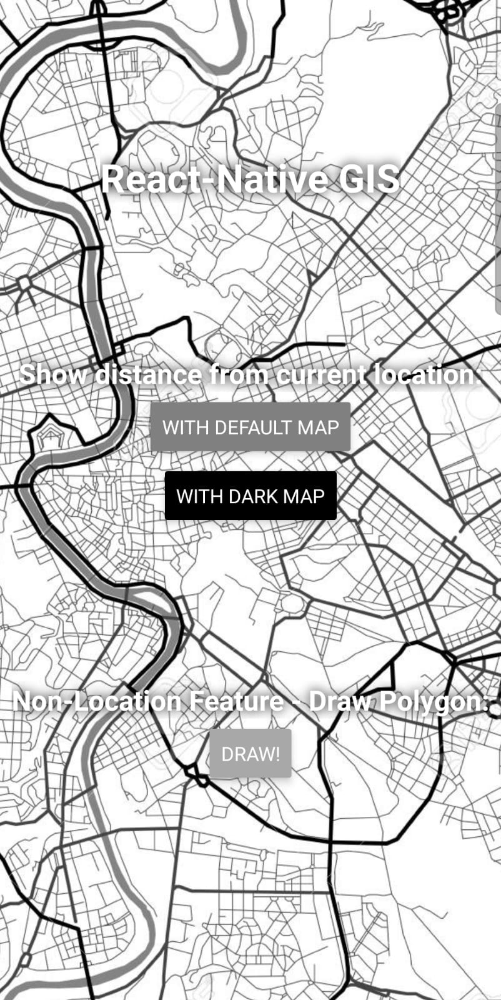
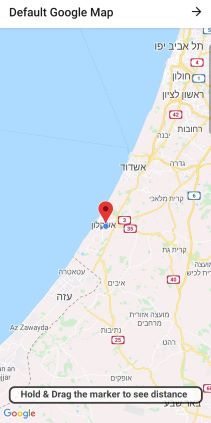
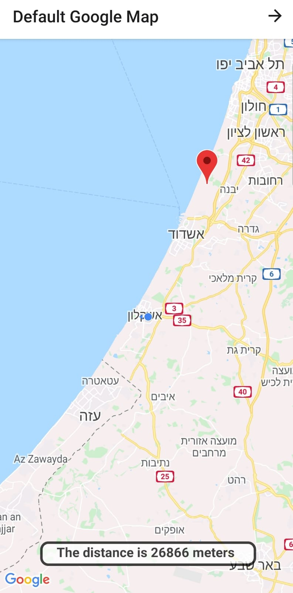
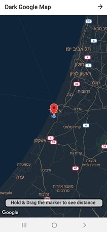
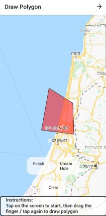

# React-Native-GIS-Course-App
App created as part of Web and Mobile GIS course in college.
In this project, we asked to implement GIS mobile application that includes user location feature.
This is our first mobile application in general, and the first React-Native project in particular.
App features can be viewed in the following screenshots:

### Homepage:

### Distance measurement:

### Distance measurement in dark mode:

### Draw polygon:

